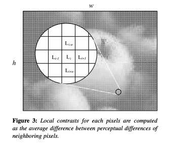
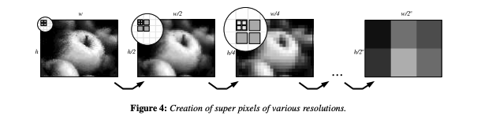

## Global Contrast Factor 
Python implementation of [Global Contrast Factor - a New Approach to Image Contrast](https://www.vrvis.at/publications/pdfs/PB-VRVis-2005-035.pdf)

$$
l = (\frac{k}{255})^\gamma
\quad
L = 100 * \sqrt{l}
$$
$$
lc_i = \frac{|L_i - L_{i-1}|+|L_i - L_{i+1}|+|L_i - L_{i-w}|+|L_i - L_{i+w}|}{4}
$$
$$
C_i = \frac{1}{w*h} *\sum_{i=1}^{w*h} lc_i
\quad
GCF = \sum_{i=1}^{N}w_i*C_i
$$


 

## Usage

```python
import cv2
from global_contrast_factor import GlobalContrastFactor

img = cv2.imread("./images/img1.png")
img_low_contrast = cv2.imread("./images/img_contrast50.png")

gfc = GlobalContrastFactor()

print(gfc(img))
print(gfc(img_low_contrast))
```

## Install
```bash
pip install global-contrast-factor-python
```

## Citations
```bibtex
@inproceedings{Matkovic2005GCF,
    title   = {High-Resolution Neural Face Swapping for Visual Effects},
    author  = {Krešimir Matkovic, László Neumann, Attila Neumann, Thomas Psik, Werner Purgathofer},
    year    = {2005}
}
```